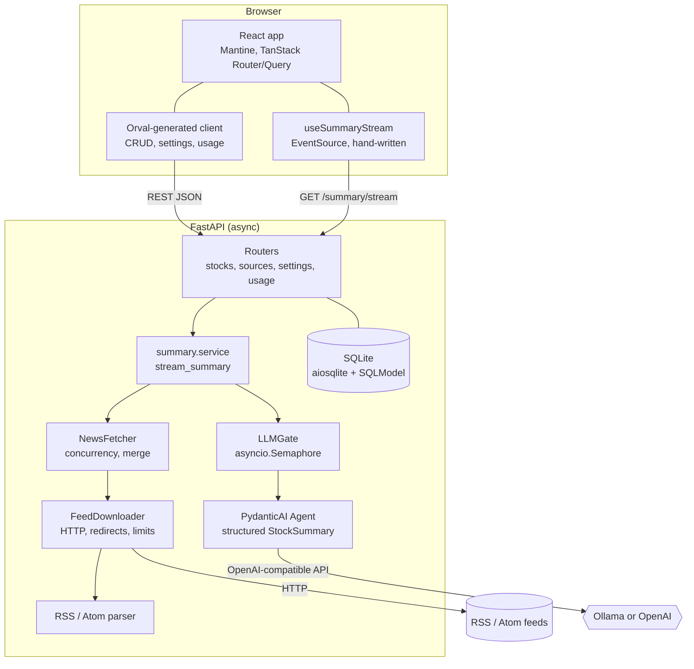
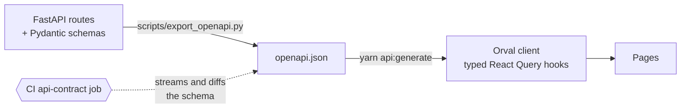

# Architecture

## The big picture



## Design principles

| Principle | How it shows up |
| --- | --- |
| **Everything async** | `httpx2.AsyncClient`, `AsyncSession` + aiosqlite, async endpoints, async PydanticAI streaming. |
| **One model call at a time** | `LLMGate` is an `asyncio.Semaphore` (default 1). Extra requests queue and the UI says so. |
| **Abandoned work is cancelled** | A closed connection cancels the stream, which drops the model call and frees the gate. |
| **Structured output, not prose** | The model must return a `StockSummary`; the UI renders fields, not text. |
| **Service knows nothing about HTTP** | `stream_summary` yields plain events; `api/stocks.py` only formats them as SSE. |
| **Config in the database** | Model, key and thinking mode are editable at runtime; env vars only seed first start. |
| **Contract first** | FastAPI's OpenAPI schema feeds Orval; CI checks that the committed schema matches the backend. |

## Backend module map

```text
backend/src/zeroai/
├── asgi.py              process bootstrap and exported ASGI app
├── bootstrap.py         process-wide logging and tracing setup
├── main.py              app factory and lifespan: engine, shared HTTP clients, LLM gate
├── config.py            pydantic-settings (ZEROAI_*), seeds only
├── logging.py           structlog setup + request-id middleware
├── database.py          async engine, Alembic upgrade runner, seeding
├── migrations/          ordered Alembic schema revisions
├── models.py            NewsSource, LLMConfig, UsageRecord tables
├── schemas.py           API shapes incl. StockSummary (the LLM output type)
├── api/
│   ├── deps.py          session, news fetcher, LLM runtime, gate, ticker validation
│   ├── stocks.py        news, summary, summary/stream (SSE)
│   ├── sources.py       news-source CRUD
│   ├── settings.py      LLM configuration (key is write-only)
│   └── usage.py         per-model and recent-run statistics
├── news/
│   ├── fetcher.py       concurrency, source orchestration, merge and sorting
│   ├── downloader.py    HTTP, redirect validation, retries and response limits
│   └── parser.py        RSS/Atom parsing and item normalization
└── summary/
    ├── agent.py         model factory, instructions, reasoning settings, LLMRuntime
    ├── limiter.py       LLMGate
    ├── service.py       fetch -> summarise orchestration and event emission
    ├── stream_parser.py PydanticAI event decoding and partial-summary validation
    └── usage.py         record and aggregate token usage
```

## Frontend module map

```text
frontend/src/
├── api/                 axios-instance.ts (mutator), generated/ (Orval, do not edit)
├── hooks/               useSummaryStream (SSE), useElapsed (timer)
├── components/          SummaryCard, ThinkingPanel, NewsList, BrailleSpinner
├── pages/               SummaryPage, SourcesPage, SettingsPage
├── stores/ui.ts         persisted Zustand store: theme mode, last ticker
├── theme/               classic.ts, terminal.ts (Mantine themes), ThemeMode.tsx
├── router.tsx           TanStack Router, header/nav
└── styles.css, terminal.css  Classic skin and the Terminal skin
```

## The OpenAPI contract loop



!!! note "Why one hook is hand-written"
    OpenAPI cannot describe a Server-Sent Events stream, so Orval cannot generate it. That one
    hook, `useSummaryStream`, mirrors the event shapes documented in [Streaming](streaming.md).
