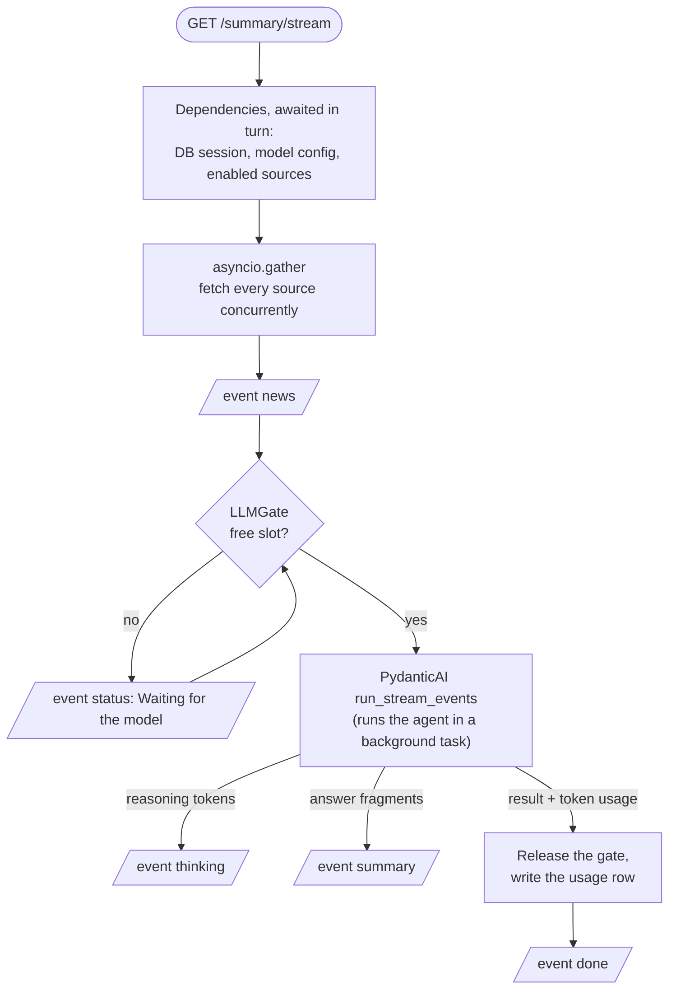
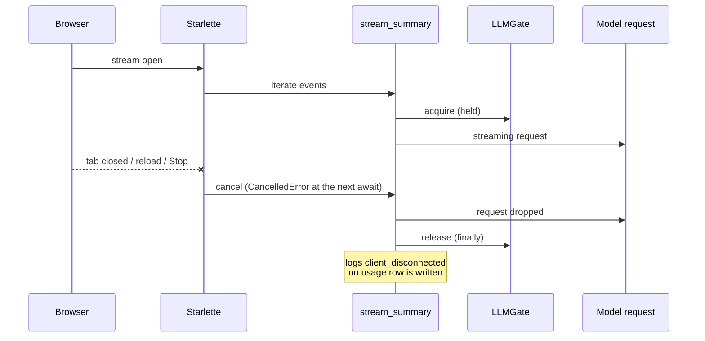

# Async: what runs in parallel

ZeroAI is **single-process, single-thread, asynchronous**. One event loop (uvicorn + asyncio) serves
every request. Nothing blocks it: network, database and model calls are all `await`ed, so while one
request waits for a feed or for the model, the loop serves another.

!!! abstract "The one-paragraph version"
    Inside one briefing the steps run **one after another**, except fetching the news feeds, which runs
    **in parallel**. Across briefings everything overlaps, except the **model call, which is
    deliberately one at a time** (a semaphore). Closing the tab cancels whatever is running.

## Where time goes in one briefing

```mermaid
gantt
    title One briefing (illustrative seconds)
    dateFormat HH:mm:ss
    axisFormat %S s
    section Feeds (in parallel)
    Yahoo Finance        :a1, 00:00:00, 2s
    Google News          :a2, 00:00:00, 3s
    Nasdaq (slow)        :a3, 00:00:00, 3s
    section Model (one at a time)
    Wait for the gate    :crit, b1, 00:00:03, 1s
    Reasoning + answer   :b2, 00:00:04, 5s
    section After
    Store usage row      :c1, 00:00:09, 1s
```

The three feeds overlap, so fetching costs as long as the **slowest** feed, not the sum. Then the
request takes its turn at the model.

## Two briefings at the same time

```mermaid
gantt
    title Two requests overlap, but the model runs one at a time
    dateFormat HH:mm:ss
    axisFormat %S s
    section Request A
    Fetch feeds (parallel)  :a1, 00:00:00, 3s
    Model                   :a2, 00:00:03, 5s
    section Request B
    Fetch feeds (parallel)  :b1, 00:00:01, 3s
    Waiting for the model   :crit, b2, 00:00:04, 4s
    Model                   :b3, 00:00:08, 5s
```

`B` fetches its news while `A` is still working, so by the time the model is free `B` is ready. Only the
model call queues. The UI shows "Waiting for the model" while it does.

## What is parallel, serial, or limited

| Step | How it runs | Why |
| --- | --- | --- |
| Fetch each news source | **In parallel**: `asyncio.gather` over all enabled sources, one shared `httpx2.AsyncClient` | I/O bound; total time is the slowest source, and one failure never blocks the others |
| Retry of a failed feed | Sequential per source, with `asyncio.sleep(0.3)` between the two tries | Only timeouts, connect errors and 5xx are retried, once |
| Parse feeds, merge, de-duplicate | Inline on the loop, one after the other | A few milliseconds of CPU; not worth a thread |
| **Model call** | **One at a time**: `LLMGate` = `asyncio.Semaphore(ZEROAI_LLM_MAX_CONCURRENCY)` | Protects a local model and Ollama's free cloud tier from being flooded |
| Reasoning and answer tokens | Streamed as they arrive; each becomes an SSE event | The user watches it live instead of waiting for the whole answer |
| Database reads and writes | `await`ed on aiosqlite (SQLite runs on a helper thread, off the event loop) | The loop never waits on disk |
| Recording usage | After `done`, in its **own** session | The request's session is closed by then |
| Different users' requests | All overlap, apart from the model gate | One loop serves them all |
| The browser | `EventSource` for the stream, React Query for REST, timers for the clock | The page stays responsive while the model works |

## One request, step by step

The route is an **async generator**: each `yield` hands one SSE event to Starlette, which sends it to the
browser immediately. The generator only advances when the client is ready, which is natural backpressure.

## The model call, in more detail

`run_stream_events` starts the agent loop in a background task and passes events to our generator
through an in-memory channel. Our code consumes them one at a time:

- a **reasoning delta** becomes a `thinking` event (dropped on the server if Thinking mode is off);
- a **fragment of the structured answer** is appended to a buffer, parsed as partial JSON, and sent as
  a `summary` event when it changed;
- the **final result** carries the validated answer and the token usage.

If the model returns nothing usable, PydanticAI asks again (up to 3 retries) and our partial-JSON buffer
is reset for the new attempt.

## Cancellation

Cancellation is **cooperative**: it lands at the next `await`, which for a model that streams tokens is
milliseconds away. A request cancelled while still queued never reaches the model and gives its place
back. This is covered by tests that cancel mid-call and while queued.

## Shared resources, created once

| Resource | Created | Why shared |
| --- | --- | --- |
| `httpx2.AsyncClient` | at startup (lifespan) | Connection pooling and keep-alive across all feed fetches |
| `AsyncEngine` (SQLite) | at startup | One pool; sessions are cheap and per request |
| `LLMGate` | at startup | The semaphore must be one object for the limit to mean anything |

## What could go wrong, and why it does not

| Risk | Answer |
| --- | --- |
| A slow feed stalls everything | Per-attempt timeout (8 s), one retry, and the other feeds are unaffected |
| A CPU-heavy step freezes the loop | There is none: parsing a feed or a partial answer is microseconds to milliseconds |
| Many tabs pile up model calls | They queue behind the gate, and abandoned ones are cancelled |
| Lost writes under concurrency | SQLite serialises writers; our writes are tiny and awaited |
| Work continues after the user left | Disconnect cancels the task, which drops the model request |

!!! note "Not parallel on purpose"
    More parallelism is not always better here. Raising `ZEROAI_LLM_MAX_CONCURRENCY` only helps for a
    hosted API or a GPU that serves several requests at once; on Ollama's free cloud tier, parallel
    requests were measured to queue on the other side (every run took about 380 s).
