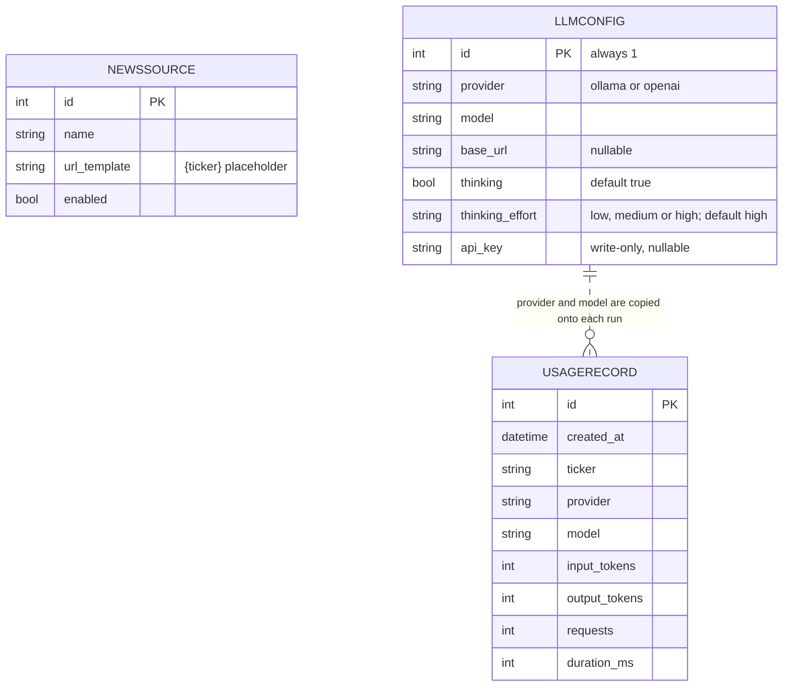

# Data model

Three small SQLite tables (async SQLModel). Tables are created on first start; columns added in later
releases are added **in place** to an existing database file (`database._ensure_columns`).

| Table | Seeded with | Edited by |
| --- | --- | --- |
| `newssource` | Yahoo Finance, Google News, Nasdaq | Sources page, `/api/v1/sources` |
| `llmconfig` | The `ZEROAI_*` env vars, **once** | Settings page, `/api/v1/settings/llm` |
| `usagerecord` | nothing | written after every successful run |

!!! warning "The API key is stored in plain text"
    This is a local, single-user app and the key lives in the SQLite file. The API never returns
    it (only `api_key_set`). For a shared deployment, put the database on encrypted storage or move
    the key to a secret manager.

## Resetting

Stop the API and delete the database file (default `backend/zeroai.db`). Sources and the model
configuration are re-seeded on the next start; usage history is lost.
