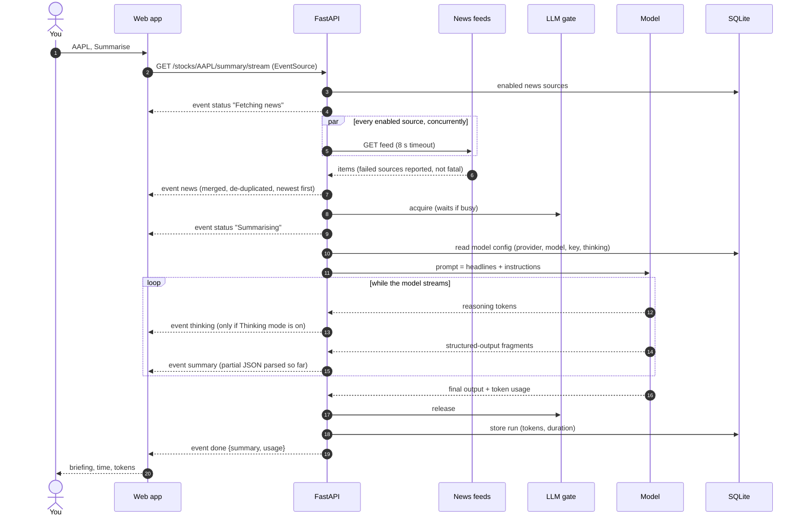
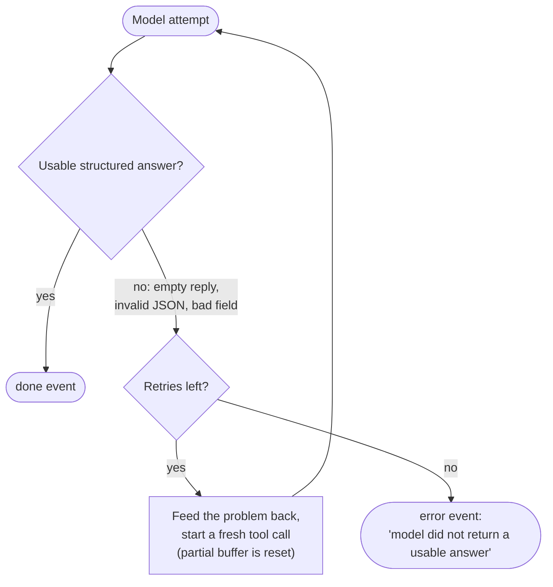
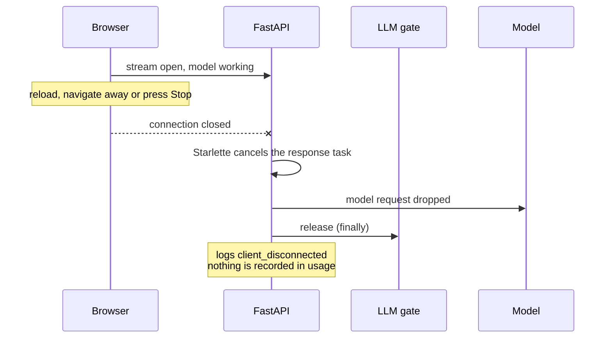
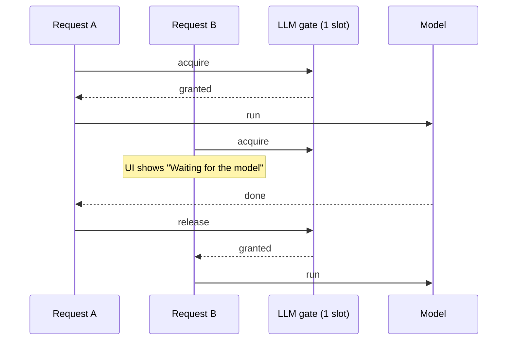

# Request flow

What happens, step by step, when you press **Summarise**.

## The happy path

## When the model needs another attempt

Small and reasoning models sometimes answer with nothing, or with broken JSON. PydanticAI tells the
model what was wrong and asks again, up to **3** times (`OUTPUT_RETRIES`).

The `usage.requests` value in the `done` event is how many attempts it took (1 means first try).

## When you close the tab

The next request starts immediately, with no "Waiting for the model".

## When requests queue

With the default concurrency of 1, two people (or two tabs) never hit the model at once.

## Errors you can see

| Situation | Event | What you see |
| --- | --- | --- |
| No feed returned anything | `error` | "No recent news found for XYZ." |
| Some feeds failed | `news` with `errors` | Briefing works, with a "Some sources failed" notice |
| Model returned nothing usable | `error` | "model did not return a usable answer ... try again or pick a different model" |
| Model/provider failure | `error` | "Summary failed: ..." |
| OpenAI selected, no key | HTTP 503 before streaming | "Add an OpenAI API key on the Settings page." |
| Connection lost | (client side) | "Connection to the server was lost." |
