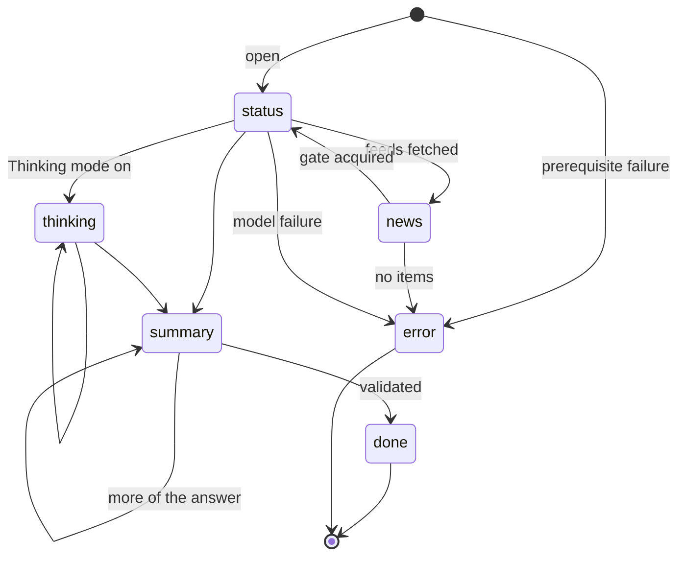
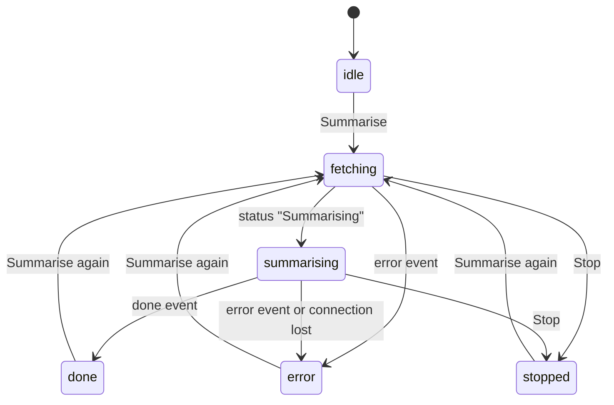
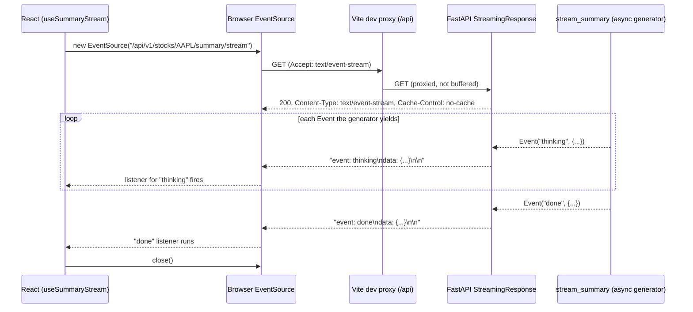

# Streaming (SSE)

`GET /api/v1/stocks/{ticker}/summary/stream` returns `text/event-stream`. Each event has a name and a
JSON body.

## Events

| Event | Body | When |
| --- | --- | --- |
| `status` | `{message}` | Progress: "Fetching news for AAPL", "Waiting for the model", "Summarising" |
| `news` | `{ticker, items, errors}` | Feeds fetched. The UI shows the sources immediately. |
| `thinking` | `{delta}` | The model's reasoning, token by token. Only when [Thinking mode](../configuration/thinking.md) is on. |
| `summary` | partial `StockSummary` | Every time the model has produced more of the answer. |
| `done` | `{summary, usage}` | Success. The stream ends. |
| `error` | `{message}` | Invalid ticker, missing model configuration/key, no news, or model failure. The stream ends. |

```text
event: news
data: {"ticker": "AAPL", "items": [...], "errors": []}

event: thinking
data: {"delta": "We need to summarise the headlines..."}

event: summary
data: {"headline": "Apple unveiled a new chip.", "sentiment": "bullish"}

event: done
data: {"summary": {...}, "usage": {"model": "gpt-oss:120b-cloud", "input_tokens": 1636,
       "output_tokens": 404, "total_tokens": 2040, "requests": 1, "duration_ms": 11016}}
```

## Event order



## What the browser does with them

`useSummaryStream` keeps one state object and maps events onto UI phases:



- The `EventSource` is **closed** on `done`, `error`, Stop and unmount. It never auto-reconnects, so a
  dropped connection can never silently re-run (and re-bill) the model.
- Closing it is also what **cancels the run on the server**; see [Request flow](request-flow.md).
- A late network error after `done` or `stopped` is ignored.
- Events from a superseded stream are ignored. Malformed JSON closes the stream with a readable error.
- Partial fields pass the same Pydantic validators as the final summary before reaching the browser.

## How SSE works in this app

SSE is a long-lived, one-way HTTP response: the server keeps the connection open and writes small text
frames, the browser parses them and fires events. No special protocol, no extra library.



### Backend

1. `GET /api/v1/stocks/{ticker}/summary/stream` returns a `StreamingResponse` over an **async generator**
   (`body()`), with `media_type="text/event-stream"`.
2. The generator pulls plain `Event(name, data)` objects from `stream_summary` and turns each into a
   frame with `format_sse`: `event: <name>\ndata: <one line of JSON>\n\n`. The blank line ends a frame.
3. Each `yield` is flushed to the socket immediately, so the browser sees tokens as the model produces
   them. The generator only advances as fast as the client reads (natural backpressure).
4. Headers: `Cache-Control: no-cache` stops caching, and `X-Accel-Buffering: no` tells nginx-style proxies
   not to hold the response back and release it in one piece.
5. Usage recording is attempted when the `done` event passes through. Database failures are logged
   without discarding the completed answer; those runs are absent from usage totals.
6. If the client disconnects, Starlette cancels the generator; see [Concurrency and
   cancellation](../configuration/concurrency.md).

The service knows nothing about HTTP or SSE: it yields events, and the same generator also powers the
non-streaming `/summary` endpoint.

Prerequisite HTTP errors on this route are translated into an `error` SSE event with HTTP 200.
This lets native `EventSource` display the reason instead of treating a missing key or invalid
ticker as a disconnected server. Other endpoints retain their normal HTTP error status codes.

### Frontend

`useSummaryStream` wraps the browser's `EventSource`:

1. `start(ticker)` opens `new EventSource(url)`. The browser sends a normal GET and keeps the response open.
2. It registers **one listener per event name** (`status`, `news`, `thinking`, `summary`, `done`,
   `error`). Each parses `event.data` as JSON and updates one React state object.
3. `done` and `error` call `close()`. `stop()` (the Stop button, a new search, leaving the page) closes it
   too, and **closing is what makes the server cancel the run**.
4. `onerror` handles the connection itself failing (backend down, network lost) and shows "Connection to
   the server was lost."

During development Vite proxies `/api` to the backend, so the browser talks to one origin and needs no CORS.

### Gotchas we hit or avoided

| Gotcha | What we do |
| --- | --- |
| **Auto-reconnect.** `EventSource` silently reconnects after an error, which would run the model again | We close it on `done`, `error`, Stop and unmount, and in `onerror` |
| **Two kinds of `error`.** Our server sends an event *named* `error` (with data); the browser fires its own `error` event (no data) when the connection drops. Both reach the same listener name | The listener ignores any event without string data; real connection errors go to `onerror`. This was a real bug: it threw `SyntaxError: "undefined" is not valid JSON` on every dropped connection |
| **Newlines in data** break a frame | `json.dumps` never emits a raw newline, so each payload stays on one `data:` line |
| **GET only, no custom headers** | Fine now; it matters if authentication is added (a cookie, or a token in the URL, rather than an `Authorization` header) |
| **Browser connection limit** (about 6 per host over HTTP/1.1) | One stream per page; each run uses one |
| **Silent gaps** | Proxies may close an idle connection (often after 60 s). We emit reasoning deltas constantly, but if reasoning is hidden a quiet stretch is possible. The usual fix is a `: ping` comment frame every ~15 s; not needed locally |
| **Replay.** SSE can resume with `id:` and `Last-Event-ID` | Not used: a dropped run is restarted by the user, never silently resumed |

!!! note "Why SSE and not WebSockets"
    The data only flows one way (server to browser), it is plain HTTP (works through proxies and the Vite
    dev server), and `EventSource` gives us parsing and named events for free. Cancelling is just closing the connection.

## The `usage` object

| Field | Meaning |
| --- | --- |
| `provider`, `model` | What produced the answer |
| `input_tokens`, `output_tokens`, `total_tokens` | As reported by PydanticAI's `RunUsage` |
| `requests` | Model calls made; more than 1 means retries |
| `duration_ms` | Wall-clock time from the start of the request (includes fetching news) |
