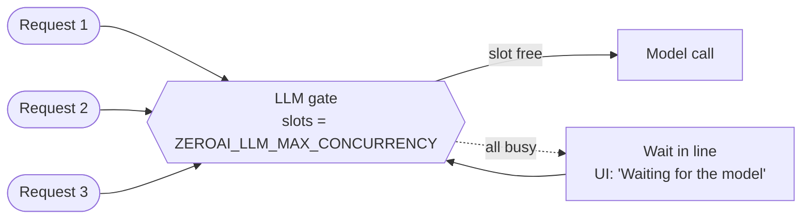
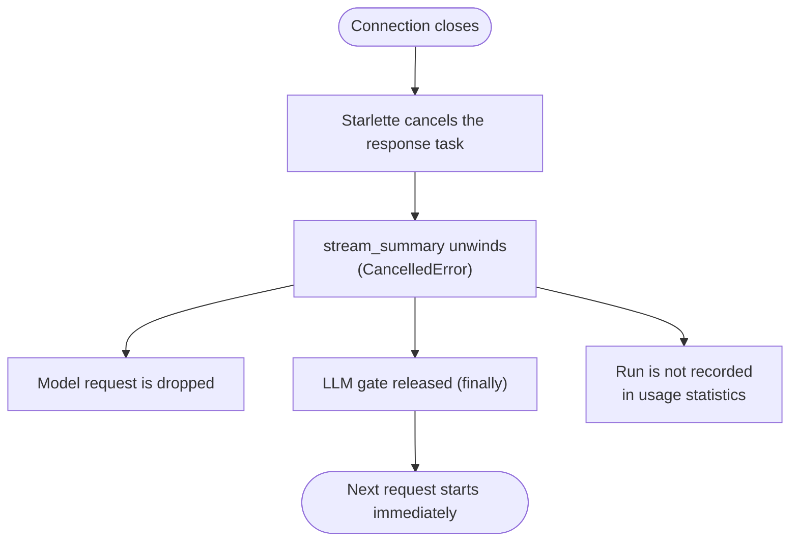

# Concurrency and cancellation

## The LLM gate

Every model call passes through `LLMGate`, a thin wrapper over `asyncio.Semaphore`. It exists so a
single local model (or a rate-limited cloud tier) is never overloaded.

| `ZEROAI_LLM_MAX_CONCURRENCY` | Use when |
| --- | --- |
| `1` (default) | One local model, or Ollama's free cloud tier |
| `2` to `4` | A hosted API or a GPU that serves parallel requests |

!!! warning "Do not benchmark in parallel"
    Sending several requests at once to the free cloud tier made every one of them take about 380 s
    (they queue on the other side). Run them one at a time.

News fetching is **not** gated: feeds are fetched concurrently, only the model call is limited.

## Cancellation

Pressing **Stop**, reloading, navigating away or closing the tab closes the SSE connection, and the
server stops the work.

- A request cancelled **while queued** never reaches the model and gives its place back.
- The API logs `client_disconnected` with the ticker and model.
- In the UI, **Stop** keeps what already arrived and shows "Stopped. The model was released."
