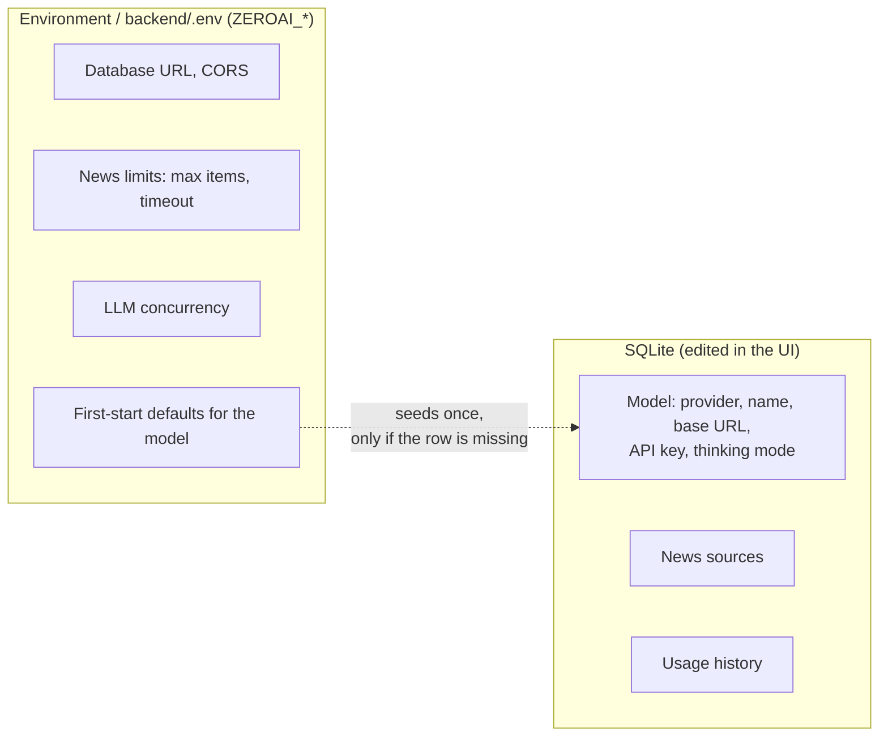

# Configuration overview

There are exactly **two places** configuration lives. Knowing which is which removes most confusion.

| I want to change... | Where | Restart needed? |
| --- | --- | --- |
| Model, API key, Ollama URL, thinking mode | **Settings** page | No, next summary |
| News sources | **Sources** page | No |
| Max simultaneous model calls | `ZEROAI_LLM_MAX_CONCURRENCY` | Yes |
| News timeout / max items | `ZEROAI_NEWS_*` | Yes |
| Database location, CORS origins | `ZEROAI_DATABASE_URL`, `ZEROAI_CORS_ORIGINS` | Yes |

!!! warning "Why changing `ZEROAI_OLLAMA_MODEL` seems to do nothing"
    The model variables only **seed** the database the first time the API starts. After that the
    Settings page wins. To start over, delete the database file (see [Data model](../concepts/data-model.md)).

## The guides

- [**Models**](models.md): Ollama local, cloud, with a token, and OpenAI.
- [**Thinking mode**](thinking.md): reasoning on or off, what each model does.
- [**News sources**](news-sources.md): feeds and the `{ticker}` placeholder.
- [**Concurrency and cancellation**](concurrency.md): the semaphore and the Stop button.
- [**Reference**](reference.md): every variable and setting in one table.

