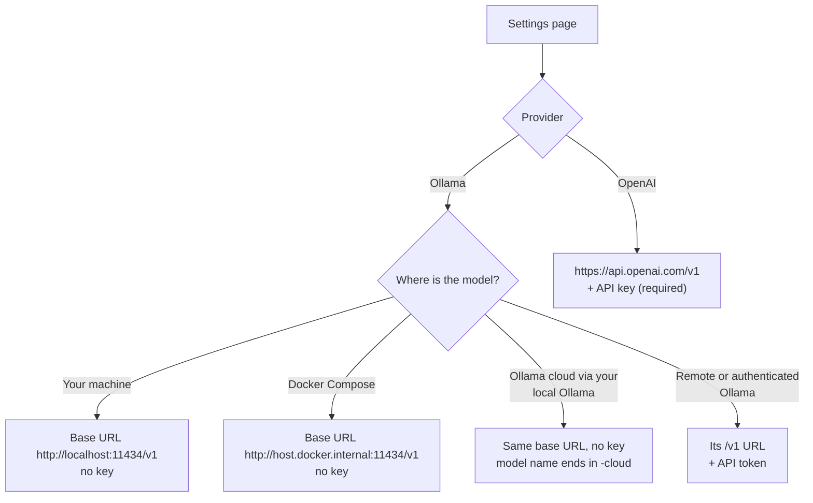

# Models

ZeroAI talks to every model through the **OpenAI-compatible chat API**, using PydanticAI. Pick a
provider on the **Settings** page.



## Pick your setup

=== "Ollama cloud (default)"

    Runs big models on Ollama's cloud, **through your local Ollama**. No download, no token to paste.

    ```bash
    ollama signin
    ```

    | Setting | Value |
    | --- | --- |
    | Provider | Ollama (local) |
    | Model | `gpt-oss:120b-cloud` |
    | Base URL | `http://localhost:11434/v1` |
    | API key | empty |

    Other cloud models work the same way; append `-cloud` to the name (for example
    `gpt-oss:20b-cloud`, `gemma4:31b-cloud`).

    !!! info "Privacy and limits"
        The prompt (public headlines) goes to Ollama's cloud. Free usage has rate limits and
        **queues parallel requests**; see [Troubleshooting](../guides/troubleshooting.md).

=== "Ollama local"

    Everything stays on your machine.

    ```bash
    ollama pull qwen3
    ```

    | Setting | Value |
    | --- | --- |
    | Provider | Ollama (local) |
    | Model | `qwen3:latest` |
    | Base URL | `http://localhost:11434/v1` |
    | API key | empty |

    !!! warning "Reasoning models and reliability"
        qwen3 can think for a whole turn and return nothing. Switch
        [Thinking mode](thinking.md) off for a faster, more reliable run.

=== "Ollama with an API token"

    For an Ollama server that requires a token (a remote host, a proxy, or Ollama's hosted API).

    | Setting | Value |
    | --- | --- |
    | Provider | Ollama (local) |
    | Model | the name that server exposes |
    | Base URL | that server's OpenAI-compatible URL, for example `https://ollama.com/v1` |
    | API key | your token |

    Remote model origins must use HTTPS and be listed in the server's exact
    `ZEROAI_ALLOWED_MODEL_ORIGINS` JSON array. The defaults include `https://ollama.com`; add any
    custom origin explicitly and restart the server. The token is sent as
    `Authorization: Bearer <token>`. It is stored in the database and is
    **write-only**: the UI shows "saved" and never the value. Use **Remove the saved key** to clear it.

    !!! warning "Not verified here"
        Token support is covered by tests (the key reaches the client as a Bearer token), but it
        was not exercised against a live authenticated Ollama host in this project.

=== "OpenAI"

    | Setting | Value |
    | --- | --- |
    | Provider | OpenAI |
    | Model | `gpt-4o-mini` (default), or any chat model with tool calling |
    | Base URL | empty (`api.openai.com`), or an operator-allow-listed OpenAI-compatible endpoint |
    | API key | `sk-...` (required) |

    Without a key the API answers **503** with "Add an OpenAI API key on the Settings page." and
    nothing is sent anywhere.

Custom model origins must be added to `ZEROAI_ALLOWED_MODEL_ORIGINS` as a JSON array of exact
origins (scheme, host, and optional port). Remote origins require HTTPS; HTTP is accepted for
loopback Ollama and the exact Docker host origin `http://host.docker.internal:11434`. The model HTTP
client does not follow redirects, so allow-list the final endpoint directly. See
[the configuration reference](reference.md#environment-variables).

## What the model must support

PydanticAI returns the structured `StockSummary` through a **tool call**, so the model must support
tool calling. The app tolerates sloppy answers (see below) but cannot work with a model that never calls
the tool.

## Tested models

Measured on real feeds, one request at a time, structured output required.

| Model | Result |
| --- | --- |
| `gpt-oss:120b-cloud` (default) | About 11 s end to end, valid on the first try, very short reasoning |
| `gpt-oss:20b-cloud` | About 7 s when run alone |
| `gemma4:31b-cloud` | Valid output |
| `qwen3:latest` (local) | About 30 s; often answers an attempt with nothing, so it needs retries |
| `llama3.2` (3B, local) | Fast, but breaks the JSON (`"[]"` strings, trailing commas, repeated tokens) |

??? note "How tolerant is the output validation?"
    Before burning a retry, the schema repairs common small-model slips: `"[]"` or a bare sentence
    for a list, `" Bullish "`, `positive` or `negative` for sentiment, and a missing `risks` field.
    Anything else triggers a retry (up to 3), described in [Request flow](../concepts/request-flow.md).
