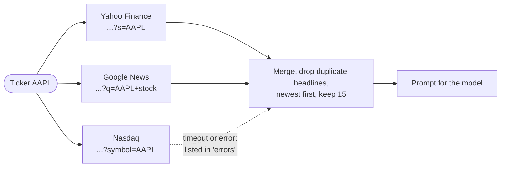
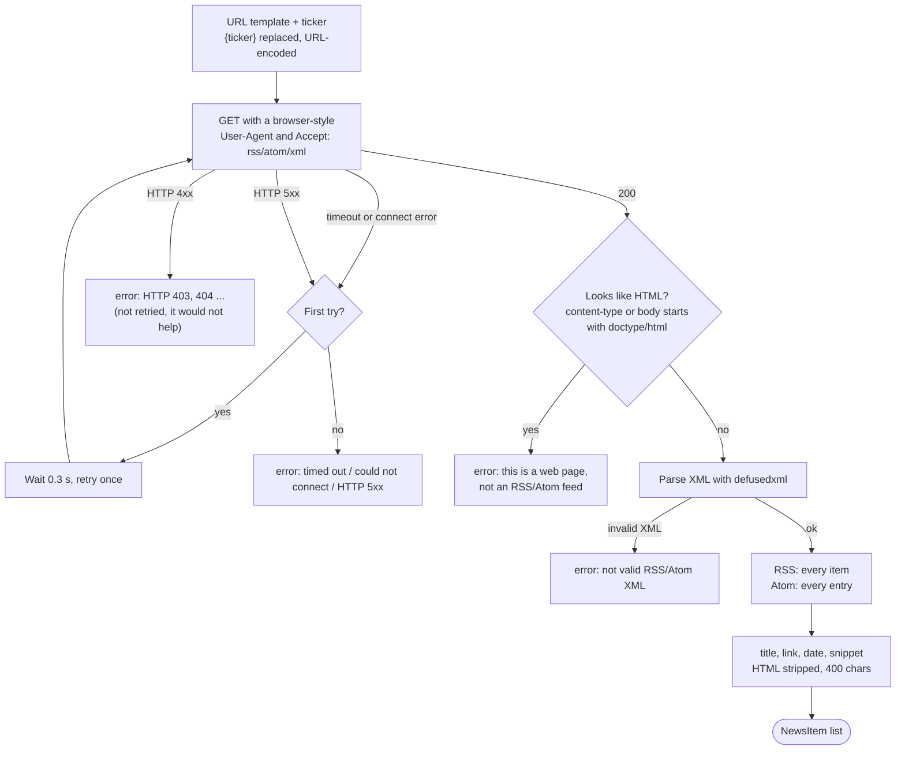

# News sources

Sources are **RSS or Atom feeds**. For every lookup, ZeroAI fetches up to 20 enabled sources with at
most five requests at a time, merges and de-duplicates the items, and feeds the newest ones to the
model. Each response is limited to 1 MB by default.



## Defaults

Seeded on first start; edit or remove freely.

| Name | URL template |
| --- | --- |
| Yahoo Finance | `https://feeds.finance.yahoo.com/rss/2.0/headline?s={ticker}&region=US&lang=en-US` |
| Google News | `https://news.google.com/rss/search?q={ticker}+stock&hl=en-US&gl=US&ceid=US:en` |
| Nasdaq | `https://www.nasdaq.com/feed/rssoutbound?symbol={ticker}` |

## Add your own

On the **Sources** page, or via the API:

```bash
curl -X POST localhost:8000/api/v1/sources -H 'content-type: application/json' \
  -d '{"name": "My feed", "url_template": "https://example.com/rss?symbol={ticker}"}'
```

| Rule | Detail |
| --- | --- |
| `{ticker}` | Replaced by the URL-encoded, upper-cased symbol. Optional (a fixed feed works too). |
| Destination | The host must appear in the server's exact `ZEROAI_ALLOWED_FEED_HOSTS` list. No wildcards or subdomain matches are used. |
| Scheme | Only `http://` and `https://` on their standard ports are accepted. |
| Format | RSS 2.0 or Atom, parsed with `defusedxml`. |
| Ticker validation | `^[A-Za-z0-9][A-Za-z0-9.-]{0,9}$`, so `BRK.B` and `BRK-B` work. |

The three built-in feed hosts are allowed by default. To add a custom host, set
`ZEROAI_ALLOWED_FEED_HOSTS` to a JSON array containing the built-ins and your trusted host, then
restart the server. Redirect destinations are checked against the same list, and each response is
streamed under the configured size limit. The source count, body size, and request concurrency can
be changed with `ZEROAI_NEWS_MAX_SOURCES`, `ZEROAI_NEWS_MAX_FEED_BYTES`, and
`ZEROAI_NEWS_FETCH_CONCURRENCY`.

## How a feed is fetched and parsed

Each source goes through the same pipeline. The point of the explicit error messages is that you
always learn *why* a source failed, not just that it did.



| Format | Items come from | Date | Snippet |
| --- | --- | --- | --- |
| RSS 2.0 | each `<item>`: `title`, `link` | `pubDate` (RFC 822) | `description`, tags stripped |
| Atom | each `<entry>`: `title`, `link href` | `updated` or `published` (ISO 8601) | `summary`, tags stripped |

Items without a title or an `http(s)` link are dropped (a feed cannot smuggle a `javascript:` link into the page); dates without a timezone are treated as UTC.

### Why a source can fail

| Message in the UI | Meaning | Fix |
| --- | --- | --- |
| `this is a web page, not an RSS/Atom feed` | The URL returns HTML. A page such as `https://edition.cnn.com/markets/stocks/AAPL` is not a feed. | Find the site's RSS/Atom URL (see below) |
| `not valid RSS/Atom XML` | The response is neither HTML nor parseable XML | Open the URL in a browser and check |
| `feed uses prohibited XML declarations` | The feed contains a DTD or entity declaration | Use a plain RSS/Atom feed without declarations |
| `feed exceeds the configured size limit` | The body is larger than `ZEROAI_NEWS_MAX_FEED_BYTES` | Use a smaller feed or raise the server limit |
| `Feed host ... is not allowed` | The host is missing from the operator's allow-list | Ask the server operator to add the exact host |
| `timed out` | No answer within `ZEROAI_NEWS_TIMEOUT_SECONDS` (after one retry) | Raise the timeout, or disable the source |
| `could not connect` | DNS or network problem | Check the host name and your connection |
| `HTTP 403` / `HTTP 404` | The server refused or does not know the URL | Fix the URL; some sites block non-browsers |

!!! example "The CNN case"
    `https://edition.cnn.com/markets/stocks/{ticker}` is a 5.7 MB HTML page with no feed link in it, so
    it can never parse. CNN publishes fixed feeds such as `http://rss.cnn.com/rss/money_markets.rss`
    (20 items). That one works, but it is **not per ticker**: every lookup receives the same
    market headlines. Prefer sources with a `{ticker}` placeholder.

!!! example "The Nasdaq case"
    Nasdaq's CDN stalls requests whose `User-Agent` looks like a library (the HTTP library's default) or contains a
    contact URL (`+https://...`), then the read times out. ZeroAI identifies as
    `Mozilla/5.0 (compatible; ZeroAI/0.1)` and the feed answers in about 3 s.

### Test a feed before you add it

On the **Sources** page, **Test feed** fetches the URL once with the ticker `AAPL` and tells you what
it found, without saving anything. Every saved source has a test button too.

```bash
curl -X POST localhost:8000/api/v1/sources/check -H 'content-type: application/json' \
  -d '{"url_template": "https://www.nasdaq.com/feed/rssoutbound?symbol={ticker}"}'
# {"ok": true, "kind": "rss", "item_count": 15, "sample": ["..."], "error": null}
```

## Behaviour worth knowing

- **One bad source never fails the briefing.** It appears in the `errors` list (with the reason above) and as a notice in the UI.
- Timeout per attempt: `ZEROAI_NEWS_TIMEOUT_SECONDS` (default 8). Timeouts, connection errors and HTTP 5xx are retried once.
- Items kept: `ZEROAI_NEWS_MAX_ITEMS` (default 15).
- Sources per lookup: `ZEROAI_NEWS_MAX_SOURCES` (default 20); requests in flight: `ZEROAI_NEWS_FETCH_CONCURRENCY` (default 5).
- Only headlines and feed snippets are used; article pages are not downloaded.

!!! warning "Server-side fetching"
    The *server* fetches URLs that users configure, including when **Test feed** is used. Exact
    operator-managed host allow-lists apply to saved feeds and redirects. Add only hosts you trust;
    see [the environment variable reference](reference.md#environment-variables).
