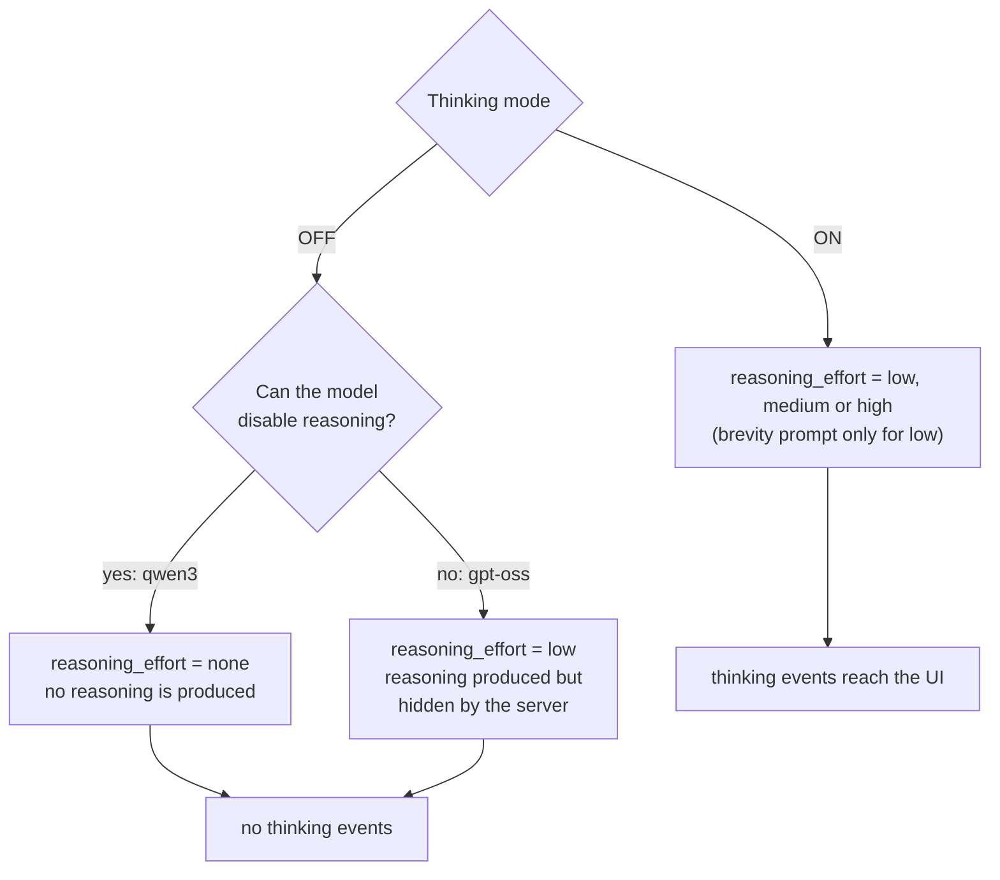

# Thinking mode

Some models "think" before answering. ZeroAI can show that reasoning live in a panel above the
briefing. The **Thinking mode** switch (Settings, Ollama only) controls it.

| Switch | What ZeroAI does |
| --- | --- |
| **ON** (default) | Asks for reasoning at the chosen **effort**, streams it to the UI as `thinking` events, collapses it when the answer starts. |
| **OFF** | Does not ask for reasoning and **never shows any**. Faster and more reliable. |

## Thinking effort

With Thinking mode on, choose how hard the model thinks: **Low**, **Medium** or **High** (default).
Measured on `gpt-oss:120b-cloud`, a full NVDA briefing from live feeds:

| Effort | Reasoning shown | End to end | What it is for |
| --- | --- | --- | --- |
| Low | about 260 characters | about 4 s | The quickest answer; the prompt also asks for brevity |
| Medium | about 800 characters | about 4 s | A short paragraph of reasoning |
| **High** (default) | about 4,500 characters | about 6 s | Thorough reasoning you can read |

!!! note "Which models honour it"
    `gpt-oss` follows all three levels. `qwen3` only has on or off, so any effort means "think".
    The effort selector is hidden when Thinking mode is off, and for OpenAI.

## What each model actually does

| Model | ON | OFF |
| --- | --- | --- |
| `gpt-oss:*` (cloud) | Reasoning at the chosen effort, shown | Lowest effort (cannot be disabled), **hidden** |
| `qwen3` (local) | Reasoning shown; ~30 s; may return nothing | No reasoning; much faster, reliable |
| Models without reasoning | Nothing to show | Same |
| OpenAI | Switch is hidden; no reasoning is requested | n/a |

!!! tip "If you see \"did not return a usable answer\""
    Turn Thinking mode **off** (or switch model). A reasoning model sometimes spends its whole turn
    thinking and returns nothing; ZeroAI retries up to 3 times, but each attempt costs a full
    thinking pass.

!!! note "Why 'off' hides instead of only disabling"
    Ollama's OpenAI-compatible endpoint maps `reasoning_effort: none` to "do not think", but
    `gpt-oss` ignores it and always reasons. So the server also drops `thinking` events when the
    switch is off, which makes the switch behave the same for every model.

## Where it is stored

`LLMConfig.thinking` (default on) and `LLMConfig.thinking_effort` (default `high`) in the database. It is part of `PUT /api/v1/settings/llm`; omit it
to keep the stored value. Databases from before this setting existed are upgraded in place.
