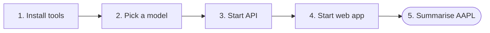
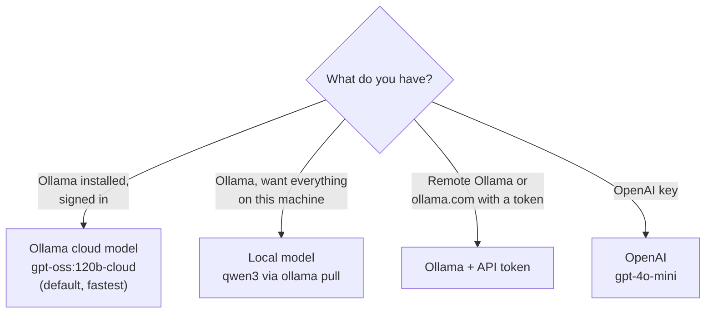

# Getting started

From zero to your first briefing in about five minutes.



## 1. Prerequisites

| Tool | Why | Check |
| --- | --- | --- |
| [uv](https://docs.astral.sh/uv/) | Python 3.14 and the backend environment | `uv --version` |
| Node 22+ and corepack | The web app (yarn 4) | `node -v` then `corepack enable` |
| [Ollama](https://ollama.com) *or* an OpenAI key | The model that writes the briefing | `ollama --version` |
| [just](https://just.systems) (optional) | Short commands used below | `just --version` |

## 2. Pick a model



=== "Ollama cloud (default)"

    ```bash
    ollama signin          # once; cloud models need no download
    ```

    Nothing else to do: the default model is `gpt-oss:120b-cloud`.

    !!! info "Privacy"
        Cloud models send the prompt (public news headlines) to Ollama's cloud.
        Choose a local model if that is not acceptable.

=== "Fully local"

    ```bash
    ollama pull qwen3
    ```

    Then, after the app is running, open **Settings** and set the model to `qwen3:latest`.
    Expect about 30 s per briefing; see [Thinking mode](configuration/thinking.md).

=== "OpenAI"

    Nothing to install. After the app is running, open **Settings**, choose **OpenAI**, and paste your
    API key.

See [Models](configuration/models.md) for every option, including an Ollama with an API token.

## 3. Install and run

```bash
just setup      # uv sync + yarn install
just api        # API on http://localhost:8000   (interactive docs at /docs)
just web        # UI  on http://localhost:5173
```

??? tip "Without `just`"
    ```bash
    cd backend  && uv sync && uv run uvicorn zeroai.asgi:app --reload
    cd frontend && corepack enable && yarn install && yarn dev
    ```

## 4. Your first briefing

1. Open <http://localhost:5173>.
2. Type `AAPL` (or click a suggestion) and press **Summarise**.
3. Watch the status line (`⠹ Summarising… 4.2 s`), the reasoning panel and the briefing fill in.
4. When it ends you see the time and token counts. **Settings** shows your usage per model.

!!! success "Try the API directly"
    ```bash
    curl localhost:8000/api/v1/stocks/AAPL/summary          # one JSON document
    curl -N localhost:8000/api/v1/stocks/AAPL/summary/stream  # live SSE events
    ```

Something not working? Go to [Troubleshooting](guides/troubleshooting.md).
