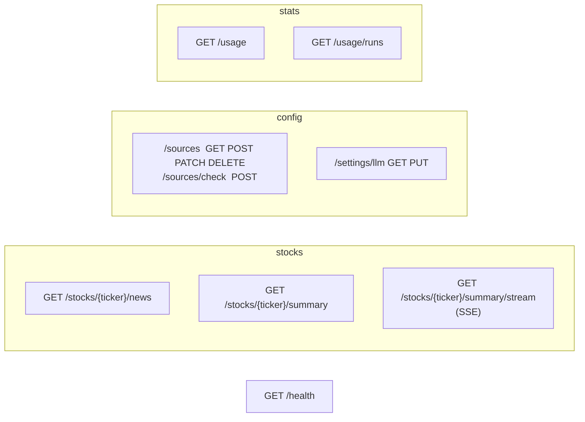

# API reference

Base path: `/api/v1`. Interactive docs (Swagger UI) at <http://localhost:8000/docs>, schema at `/openapi.json`.



## Endpoints

| Method and path | Purpose |
| --- | --- |
| `GET /health` | Liveness: `{"status": "ok"}` |
| `GET /stocks/{ticker}/news` | Merged headlines and per-source `errors` |
| `GET /stocks/{ticker}/summary` | One-shot summary (`StockSummary` JSON); records usage |
| `GET /stocks/{ticker}/summary/stream` | The same, as [SSE events](../concepts/streaming.md) |
| `GET /sources` | List news sources |
| `POST /sources/check` | Try a feed URL once: `{ok, kind, item_count, sample, error}`; saves nothing |
| `POST /sources` | Create `{name, url_template, enabled?}` (201) |
| `PATCH /sources/{id}` | Update any of `name`, `url_template`, `enabled` |
| `DELETE /sources/{id}` | Delete (204) |
| `GET /settings/llm` | `{provider, model, base_url, thinking, thinking_effort, api_key_set}` |
| `PUT /settings/llm` | Update; see below |
| `GET /usage` | Per provider/model: runs, requests, tokens, average duration |
| `GET /usage/runs?limit=20` | Latest runs, newest first (1 to 200) |

## Status codes

| Code | When |
| --- | --- |
| 200 / 201 / 204 | Success |
| 404 | Unknown source id |
| 409 | Creating a source would exceed the configured source limit |
| 422 | Invalid ticker or body (for example a non-http URL) |
| 502 | `/summary`: no news, or the model failed |
| 503 | OpenAI selected without an API key |

The streaming endpoint reports prerequisite failures (including an invalid ticker or missing
API key) as an `error` SSE event with HTTP 200, so browser `EventSource` clients can display the
reason. Non-streaming endpoints retain the HTTP status codes above. Partial summary events
contain only fields that pass the same Pydantic field validation as the final answer.

Usage recording is best effort. If its database write fails, the completed summary is still
returned and the server logs `usage_record_failed`; that run will be absent from usage totals.

## Examples

```bash
# Change the model and turn thinking off
curl -X PUT localhost:8000/api/v1/settings/llm -H 'content-type: application/json' \
  -d '{"provider":"ollama","model":"gpt-oss:120b-cloud","base_url":"http://localhost:11434/v1","thinking":false}'

# Add an API token for an Ollama that needs one (never returned afterwards)
curl -X PUT localhost:8000/api/v1/settings/llm -H 'content-type: application/json' \
  -d '{"provider":"ollama","model":"gpt-oss:120b","base_url":"https://ollama.com/v1","api_key":"..."}'

# Usage per model
curl localhost:8000/api/v1/usage
```

`PUT /settings/llm` field semantics:

| Field | Omitted / `null` | Value |
| --- | --- | --- |
| `api_key` | keep the stored key | `""` removes it, anything else replaces it |
| `thinking` | keep the stored value | `true` / `false` |
| `thinking_effort` | keep the stored value | `low`, `medium` or `high` |
| `base_url` | clears it (default URL is used) | a server-allow-listed origin; remote origins require HTTPS |
