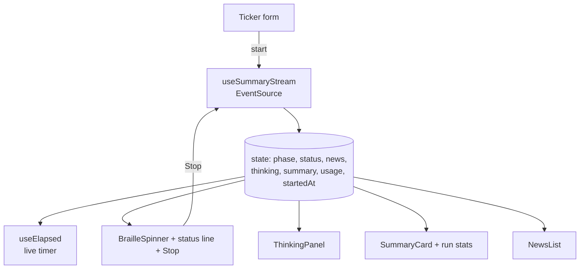

# Frontend guide

Vite + React 19 + Mantine 9, TanStack Router and Query, yarn 4. The look is a monochrome, shadcn-style
theme (`src/theme.ts`, `src/styles.css`) with light and dark modes.

## Pages

| Route | Page | What it does |
| --- | --- | --- |
| `/` | Summary | Ticker search, live status, reasoning panel, briefing, sources |
| `/sources` | Sources | Add, enable or disable and delete feeds |
| `/settings` | Settings | Model, API key, thinking mode, token usage |

On large screens the content column is **70% of the width**; below 1200 px it is full width.

## How the summary page works



- **Spinner:** a braille-dot spinner (like modern CLIs) that holds still if the user prefers reduced motion.
- **Timer:** `useElapsed` counts while a run is active; the final duration comes from the server.
- **Reasoning panel:** open while the model thinks, collapses when the answer starts; click to reopen.

## Explained badges

Every badge explains itself on hover, keyboard focus or tap (`InfoBadge`): sentiment (what *bullish*,
*bearish*, *neutral* and *mixed* mean, and that it is not a prediction), time and token counts (with
the real input and output numbers and how many model calls were made), the source of a headline, and
the "off" marker on disabled feeds.

## The search box

On the Summary page the ticker box is **empty and focused** as soon as the page has loaded, so you can
just start typing and press Enter. **Summarise** stays unavailable (dashed, with a "Enter a ticker
first" tooltip) until there is something to summarise. Nothing is remembered between visits.

## Loading states

Content that is still on its way is shown as skeleton placeholders, never as an empty box:

| Where | While | Replaced by |
| --- | --- | --- |
| Articles column, Summary page | the news sources are being fetched | the real article cards |
| Briefing card | the model has not produced a headline yet | the streamed briefing |
| Model settings | the saved settings are loading | the filled-in form |
| Sources list | the list is loading | the source cards |

## Themes

Classic and Terminal ("Geek mode") share all components. The choice is kept in a persisted Zustand
store; see [Themes](themes.md) for the mechanism, the Terminal design tokens and how to add another.

## Typography

| Use | Font |
| --- | --- |
| Interface (Classic) | Geist (the shadcn/Vercel UI face) |
| Timer, spinner, reasoning text | Geist Mono |
| Big page titles (Classic) | Instrument Serif, with an italic second half in the hero |
| Everything (Terminal) | JetBrains Mono |

Loaded from Google Fonts in `index.html` with system fallbacks, so the app still works offline.

## Working with the generated API client

```bash
just openapi        # intentionally export FastAPI's schema, then regenerate the Orval client
```

Never edit `src/api/generated/`. Orval creates typed hooks (`useListSources`, `useGetLlmSettings`,
`useGetUsageByModel`, ...) that call `src/api/axios-instance.ts`.

## Commands

| Command | Purpose |
| --- | --- |
| `yarn dev` | Dev server on :5173, proxies `/api` to :8000 |
| `yarn test` | Vitest with coverage, fails under 90% |
| `yarn e2e` | Playwright on :5273 with Orval-generated MSW handlers; no FastAPI server required |
| `yarn lint`, `yarn typecheck`, `yarn format:check` | Static checks |
| `yarn build` | Type-check and production build |
