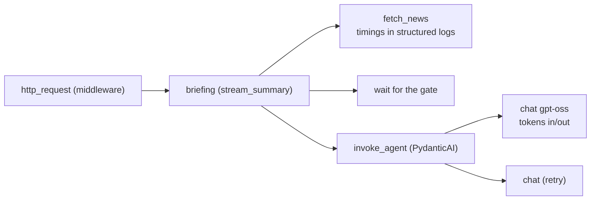

# Observability: logs and tracing

## Logging (structlog)

Every step of a briefing writes one **event** with named fields (not a sentence), so a log line can be
filtered, counted and joined. Configure with two settings:

| Variable | Default | Values |
| --- | --- | --- |
| `ZEROAI_LOG_LEVEL` | `INFO` | `DEBUG`, `INFO`, `WARNING`, `ERROR` |
| `ZEROAI_LOG_FORMAT` | `console` | `console` (readable, colour on a terminal) or `json` (one object per line) |

### Reading one briefing

Real output (shortened), from a live run with three feeds and a cloud model:

```text
briefing_started    ticker=MSFT provider=ollama model=gpt-oss:120b-cloud show_thinking=True request_id=demo-run-1
news_fetch_started  sources=3 skipped_disabled=0
feed_fetched        source='Yahoo Finance' items=16  duration_ms=264
feed_fetched        source='Google News'   items=100 duration_ms=666
feed_fetched        source=Nasdaq          items=15  duration_ms=2100
news_ready          items=15 unique_items=128 failed_sources=0 duration_ms=2101
model_acquired      waited_ms=0
model_started       news_items=15
model_first_token   kind=thinking after_ms=705
model_first_token   kind=answer   after_ms=7346
model_finished      input_tokens=1498 output_tokens=1497 requests=1 retried=False model_ms=7443
briefing_finished   total_ms=9544 sentiment=mixed
usage_recorded      total_tokens=2995 duration_ms=9544
http_request        method=GET path=/api/v1/stocks/MSFT/summary/stream status=200 cancelled=False duration_ms=9603
```

What it tells you at a glance: the three feeds ran **in parallel** (`news_ready` at 2101 ms is the slowest
feed, not the sum), the model waited 0 ms for a slot, reasoning began after 705 ms and the answer after
7.3 s, and nothing was retried.

### Events

| Event | Level | Fields | Meaning |
| --- | --- | --- | --- |
| `app_started`, `app_stopped` | info | database, concurrency, timeout, format | Lifecycle |
| `sources_seeded`, `llm_config_seeded` | info | counts, provider, model | First-start seeding |
| `briefing_started` | info | ticker, provider, model, show_thinking | A run begins |
| `news_fetch_started` | info | sources, skipped_disabled | Feeds are about to be fetched in parallel |
| `feed_fetched` | info | source, items, duration_ms | One feed answered |
| `feed_retry` | warning | host, reason, delay_ms | First attempt timed out or got a 5xx; trying once more |
| `feed_failed` | warning | source, reason, duration_ms | A feed gave up (briefing continues) |
| `news_ready` | info | items, unique_items, failed_sources, duration_ms | Feeds merged |
| `no_news` | warning | failed_sources, duration_ms | Nothing to summarise; the model is not called |
| `model_queued` | info | reason | Another run holds the model |
| `model_acquired` | info | waited_ms | This run got the model slot |
| `model_started` | info | news_items | The model call begins |
| `model_first_token` | info | kind (`thinking` / `answer`), after_ms | Time to first reasoning and answer token |
| `model_retry` | warning | reason | The model's answer was unusable; asking again |
| `model_finished` | info | input_tokens, output_tokens, requests, retried, thinking_chars, model_ms | The model call ended |
| `briefing_finished` | info | total_ms, sentiment | Success |
| `usage_recorded` | info | ticker, model, total_tokens, requests, duration_ms | The run was stored |
| `model_gave_no_usable_answer` | warning | error, duration_ms | Retries exhausted |
| `model_failed` | error | phase, duration_ms, **traceback** | Unexpected provider failure |
| `client_disconnected` | info | phase (`fetching_news`, `waiting_for_model`, `model_running`), after_ms | The browser left; the run was cancelled |
| `llm_settings_updated` | info | provider, model, thinking, effort, api_key_set | Settings changed (never the key) |
| `source_created/updated/deleted`, `feed_checked` | info | id, name, ok, kind, items, error | Source management |
| `http_request` | info (debug for `/health`, warning for 5xx) | method, path, status, duration_ms, cancelled | One summary line per request |

### Following one request

A middleware gives every request an id, returns it as the `X-Request-ID` header, and puts it on **every**
log line written while handling it, including inside the streaming response. The ticker is bound the
same way as soon as it is validated.

- Send your own `X-Request-ID` (letters, digits, `.`, `_`, `-`, up to 64 characters) to correlate with
  another system. Anything else is replaced.
- `cancelled=True` on `http_request` means the client left before the response finished.

With JSON logs, `jq` does the rest:

```bash
ZEROAI_LOG_FORMAT=json uv run uvicorn zeroai.asgi:app | tee zeroai.log

jq -c 'select(.request_id == "demo-run-1")' zeroai.log               # one request
jq -c 'select(.event == "model_finished") | {ticker, model_ms, output_tokens}' zeroai.log
jq -c 'select(.level == "warning")' zeroai.log                       # retries, failed feeds
jq -s 'map(select(.event == "feed_fetched")) | group_by(.source) |
       map({source: .[0].source, avg_ms: (map(.duration_ms) | add / length)})' zeroai.log
```

### What is never logged

| Not logged | Instead |
| --- | --- |
| API keys | `api_key_set` and `api_key_changed` booleans |
| The prompt and the headlines | Only counts (`news_items`, `items`) |
| Full feed URLs (they can carry tokens) | Only the host (`feed_retry`) or the source name |
| Model output | Only sizes (`thinking_chars`, tokens) |

Tests assert this: a secret sent through the settings API must not appear in the captured output.

## Tracing

Logs say *what happened*. A **trace** adds *how long each nested step took*, with the model call and its
token counts as child spans. PydanticAI emits an `agent run` span with a `chat <model>` child; the
project's Logfire instrumentation prints those spans locally and excludes prompt and answer content.

### Local setup

Logfire is a backend dependency. Tracing is off by default in `Settings`; this repository's ignored
`backend/.env` enables console tracing locally. To turn it on for another run:

```bash
cd backend
ZEROAI_TRACING=console uv run uvicorn zeroai.asgi:app --reload
```

`zeroai.asgi` configures Logfire with `send_to_logfire=False` and `include_content=False`: spans
print locally, and prompts and answers are not recorded. The ASGI entry point applies this
process-wide setup; `create_app()` itself does not change global logging or tracing state.

### Span coverage



PydanticAI provides the model's `invoke_agent` and `chat` spans. Fetch and gate durations are
currently available as structured log events. The run span carries `request_id` and `ticker`, so it
can be matched to those logs.

```
22:28:08.407   agent run
22:28:08.408     chat gpt-oss:120b-cloud
```

See `backend/src/zeroai/tracing.py` for the Logfire configuration.
