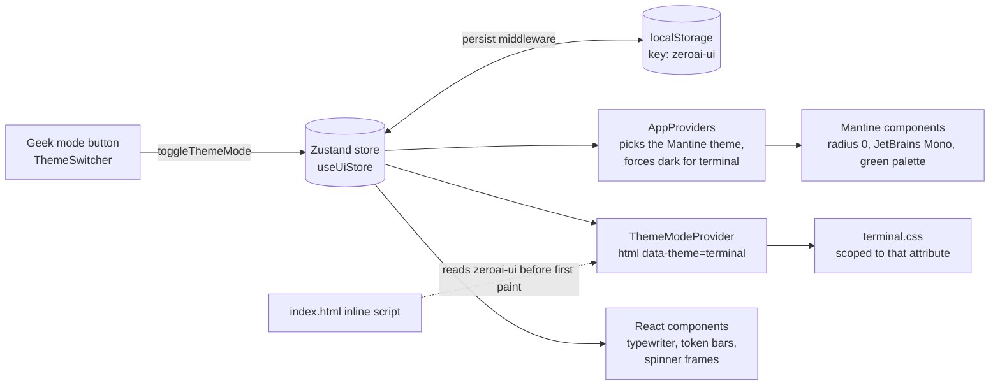

# Themes

ZeroAI has two looks. It opens in **Classic**; the header button switches between the two:
**Switch to classic UI** in Terminal, **Geek mode** in Classic.

| | Classic (default) | Terminal ("Geek mode") |
| --- | --- | --- |
| Feel | Monochrome, shadcn-style | A phosphor-green shell: `tmux`, `vim`, a mainframe |
| Colour scheme | Light, dark, or follow the OS | Dark only (the light/dark button is hidden) |
| Type | Geist, Geist Mono, serif titles | JetBrains Mono everywhere, ALL CAPS headings |
| Corners | Rounded | Square, 1px borders, no shadows |
| Extras | Tooltips, soft cards | Typewriter headline, scanlines, `[ BRACKETED ]` buttons, `[|||||.....]` token bars, `[OK]` and `[ERR]` status lines |

The choice is remembered in this browser (see below), so it survives a reload and applies before the
first paint, with no flash of the other theme.

## How the switch works



Three layers cooperate, each doing what it is best at:

| Layer | Where | Does |
| --- | --- | --- |
| **State** | `src/stores/ui.ts` | One persisted Zustand store: `themeMode` |
| **Tokens** | `src/theme/classic.ts`, `src/theme/terminal.ts` | Two Mantine themes: palette, radius, fonts, component defaults |
| **Skin** | `src/styles.css`, `src/terminal.css` | Effects Mantine tokens cannot express: scanlines, brackets, glow, glitch |

Components that need *different markup* (not just different CSS) read the mode with `useThemeMode()`:
the typed headline, the `$` prompt, the token bars, the `[OK]` line and the ASCII
spinner.

## What is remembered in the browser

`useUiStore` is persisted to `localStorage` under the key `zeroai-ui` (Zustand `persist`):

```json
{ "state": { "themeMode": "terminal" }, "version": 1 }
```

| Field | Meaning |
| --- | --- |
| `themeMode` | `classic` (default) or `terminal` |

- Only data is stored, never functions. A hand-edited or corrupt value falls back to the defaults
  instead of breaking the app, and blocked storage (private windows) just means it is not remembered.
- **Model, API key, sources and usage are not here:** those are server-side settings in the database
  and apply to every browser. This store is only for how *this* browser looks and what it remembers.
- Mantine stores the Classic light/dark choice itself, separately.

## Terminal design tokens

Defined once in `src/theme/terminal.ts` (`TERMINAL`) and mirrored as CSS variables in `terminal.css`.

| Token | Value | Use |
| --- | --- | --- |
| background | `#0a0a0a` | Page and panes (not pure black, so scanlines show) |
| primary | `#33ff00` | Text, borders on hover, cursor, active states |
| secondary | `#ffb000` | Warnings (Risks), link hover |
| muted | `#1f521f` | Borders and inactive elements |
| error | `#ff3333` | Errors (`[ERR]`) |
| radius | `0` | Everywhere |
| glow | `0 0 5px rgba(51,255,0,.5)` | Text shadow that mimics phosphor persistence |

Component conventions:

- **Buttons** are `[ LABEL ]`; hover inverts (green fill, black text). Icons sit inside the brackets.
  Disabled buttons are dashed and dimmed.
- **Badges** are `[ BULLISH ]`; the brackets wrap the label so the text is never squeezed.
- **Panes** are black boxes with a 1px green border; the briefing has a `+--- AI BRIEFING ---+` title bar.
- **Inputs** have no box: a `$` prompt, a dashed underline and a block cursor.
- **Active page** in the nav is inverted video; links read `./summary`.
- **Motion**: blinking cursor, a one-shot glitch on nav hover. Both stop under `prefers-reduced-motion`,
  and the typewriter shows the whole headline at once.
- **Small screens**: the nav drops the `./` prefix and the wordmark so it stays on one line, and the
  search form wraps.

!!! note "Accessibility"
    Green on near-black is about 14:1 contrast. Focus stays visible (the input underline turns solid
    and fills), icon-only controls keep their `aria-label`, `aria-pressed` reflects the switch, the
    scanlines never intercept clicks, and the wordmark appears once, in the header.

## Adding a third theme

1. Create `src/theme/<name>.ts` with a Mantine `createTheme`.
2. Add the name to `ThemeMode` in `src/stores/ui.ts` (and to the `merge` check there).
3. Pick it in `ThemedMantine` (`src/AppProviders.tsx`).
4. Write `src/<name>.css`, scoped to `:root[data-theme='<name>']`.
5. Add tests next to `src/theme/ThemeMode.test.tsx` and an e2e case in `e2e/theme.spec.ts`.
