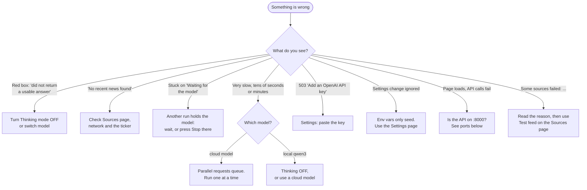

# Troubleshooting

Start at the top and follow the arrows.



## Symptoms

### "model did not return a usable answer"

The model replied to every attempt (up to 4 calls) with nothing, or with JSON that does not match the
schema. Typical for local reasoning models (qwen3), which can spend the whole turn thinking.

1. **Settings**, turn **Thinking mode** off, Save, try again.
2. Still failing? Use a bigger or cloud model (`gpt-oss:120b-cloud`).
3. The Settings page **Token usage** shows how many `requests` a run needed; more than 1 means it retried.

### Very slow runs

| Cause | Fix |
| --- | --- |
| Local reasoning model | Thinking mode off, or a cloud model |
| Cloud free tier queueing parallel requests | One request at a time (`ZEROAI_LLM_MAX_CONCURRENCY=1`, the default) |
| Many long headlines | Lower `ZEROAI_NEWS_MAX_ITEMS` |

The status line shows live elapsed time; the final badge shows the total.

### "Waiting for the model"

Only one model call runs at a time. Another tab, or another person, is using it. Wait, or open
that run and press **Stop**. A run abandoned by closing its tab frees the slot immediately.

### I turned Thinking off but still saw reasoning

Fixed: with the switch off the server no longer forwards reasoning, even for models that cannot stop
thinking (gpt-oss). If you still see it, check the page was reloaded and that you pressed **Save**
(the "Saved" tick appears).

### "Some sources failed: ..."

The briefing still works from the other sources. The text after the name says why:

| You see | Do this |
| --- | --- |
| `CNN: this is a web page, not an RSS/Atom feed` | The URL is a web page. Use the site's RSS/Atom URL. |
| `X: not valid RSS/Atom XML` | The URL does not return a feed; open it in a browser. |
| `X: timed out` | Slow host (already retried once). Raise `ZEROAI_NEWS_TIMEOUT_SECONDS` or disable it. |
| `X: HTTP 403` | The site blocks the request; try another source. |
| `X: could not connect` | Wrong host or no network. |

Use **Test feed** on the Sources page to check a URL before saving it. Details and the CNN and
Nasdaq examples are in [News sources](../configuration/news-sources.md#how-a-feed-is-fetched-and-parsed).

### Ollama cloud model not found

Cloud model names end in `-cloud` (`gpt-oss:120b-cloud`), and you must be signed in:

```bash
ollama signin
curl -s localhost:11434/v1/chat/completions -d '{"model":"gpt-oss:120b-cloud","messages":[{"role":"user","content":"hi"}]}'
```

## Reading the logs

Every request has an id (`X-Request-ID` response header, `request_id` on each log line). Find it, then
read that request's lines in order: which feed was slow (`feed_fetched duration_ms`), whether the model
had to wait (`model_acquired waited_ms`), whether it retried (`model_retry`, `retried=True`), where a
cancelled run stopped (`client_disconnected phase=...`). Details in [Observability](observability.md).

## Ports and processes

| Service | Port | Check |
| --- | --- | --- |
| API | 8000 | `curl localhost:8000/api/v1/health` |
| Web app | 5173 | open <http://localhost:5173> |
| Ollama | 11434 | `curl localhost:11434/api/tags` |
| Playwright (e2e) | 5273 | started by `yarn e2e` |

!!! warning "Another project on the same port"
    If another dev server already uses 8000 or 5173, you may talk to the wrong one. See what is
    listening with `lsof -nP -iTCP:8000 -sTCP:LISTEN`.

## Starting over

```bash
rm backend/zeroai.db      # stop the API first: sources, model and usage are re-seeded
```
