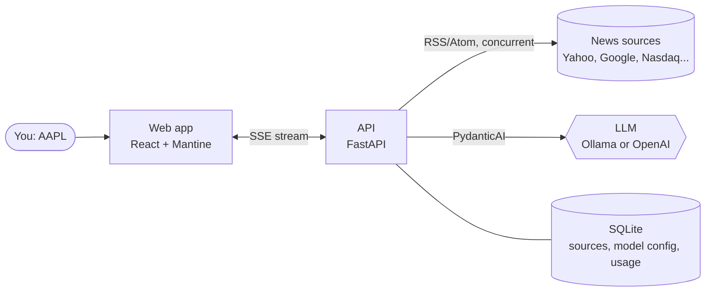

# ZeroAI

**A one-page, AI-written briefing of the latest news for a stock.** Type a ticker, and ZeroAI reads
the newest headlines from your news sources and streams a structured summary into the page while
the model writes it: sentiment, key points, risks and an outlook, with the sources beside it.

## What you get

| | |
| --- | --- |
| **Live streaming** | Status, reasoning, partial summary and final answer arrive over Server-Sent Events. |
| **Your sources** | RSS/Atom feeds on the server's host allow-list, with optional `{ticker}` templates. Manage them in the UI. |
| **Your model** | Local Ollama, an Ollama cloud model, an Ollama with an API token, or OpenAI. Switch in the UI. |
| **Thinking mode** | Watch the model's reasoning live, or switch it off for speed and reliability. |
| **Cost visibility** | Time and token usage after every run, aggregated per model. |
| **Safe by design** | One model call at a time (semaphore); closing the tab aborts the run. |

## Where to go next

=== "I want to run it"

    1. [Getting started](getting-started.md): install, pick a model, first briefing.
    2. [Models](configuration/models.md): Ollama (local, cloud, token) or OpenAI.

=== "I want to understand it"

    1. [Architecture](concepts/architecture.md): the pieces and how they connect.
    2. [Request flow](concepts/request-flow.md): one briefing, step by step.
    3. [Streaming](concepts/streaming.md): the SSE events and the UI states.

=== "Something is wrong"

    1. [Troubleshooting](guides/troubleshooting.md): symptom to fix, with a decision chart.

=== "I want to change it"

    1. [Configuration overview](configuration/index.md): what lives where.
    2. [API reference](guides/api.md) and [Frontend guide](guides/frontend.md).
    3. [Testing](testing.md): strategy, commands and CI.
