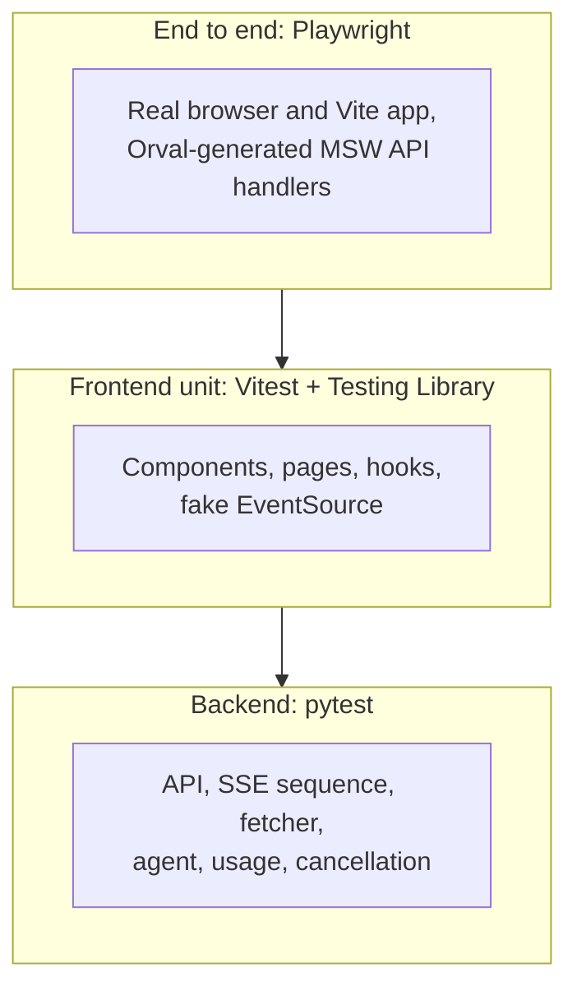
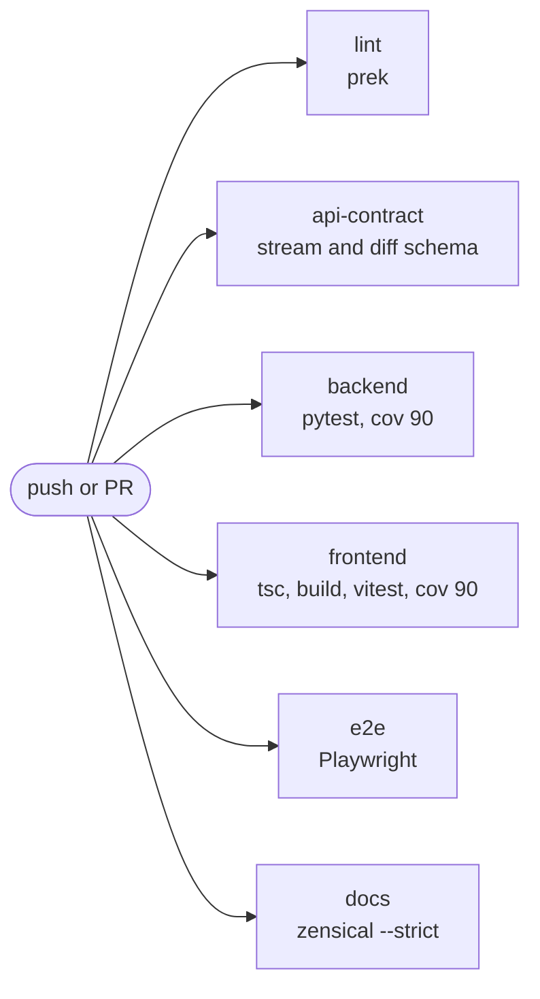

# Testing

Tests require no Ollama, API key, or separately running FastAPI server. Backend tests use the
in-process `TestClient` and mock outgoing HTTP with **pookx**. Playwright runs the real browser and
Vite app with MSW handlers generated from the OpenAPI contract by Orval. Install dependencies and
Chromium before running offline.



## Commands

| Command | Runs |
| --- | --- |
| `just test-backend` | pytest with coverage (fails under 90%) |
| `just test-frontend` | Vitest with coverage (fails under 90%) |
| `just e2e` | Playwright (installs Chromium first) |
| `just test` | All three |
| `just lint` | `prek run --all-files`: hygiene, ruff, ruff format, ty, eslint, prettier |
| `just openapi` | Intentionally regenerate the OpenAPI schema and Orval client after schema changes |
| `just check-api` | Compare FastAPI's current schema with the checked-in OpenAPI file; drift fails without changing files |
| `just build` | Frontend TypeScript check and production build |
| `just docs-build` | Strict Zensical build (broken links fail) |
| `just check` | Lint, API contract, production build, all tests, and strict docs |

Both backend and frontend enforce 90% coverage gates. The test output reports current coverage.
After changing the API, run `just openapi` to refresh the checked-in schema and Orval client. CI's
schema check only compares FastAPI's current schema with the checked-in OpenAPI file; it leaves the
schema and generated client untouched.

## Mocking the internet with pookx

The backend uses **httpx2** and the tests mock it with [**pookx**](https://github.com/jharibo/pookx),
a maintained fork of `pook` that supports httpx2. It installs under the module name `pook`, so the
tests say `import pook`; a guard test checks that pookx (not the original) is what is installed.

```python
# conftest.py: an autouse fixture. No test can reach the internet.
with pook.use():
    pook.disable_network()               # an unmocked URL raises PookNoMatches
    pook.enable_network("testserver")    # ...except Starlette's TestClient talking to the app
    yield
```

```python
# a test: first attempt times out, the retry works, and we can assert both happened
pook.get(URL).error(httpx2.ReadTimeout("slow"))
second = pook.get(URL)
second.reply(200).body(RSS)
...
assert second.isdone()
```

| Need | pookx |
| --- | --- |
| Success, status codes, body, headers | `pook.get(url).reply(200).header(...).body(...)` |
| Failure | `.error(httpx2.ReadTimeout("slow"))` or `.error(httpx2.ConnectError(...))` |
| Answer once, then something else | register mocks in order; each is consumed once |
| Answer every time | `.persist()` |
| Any path or query on a host | `pook.regex(r"^https://host/.*")` |
| The request must carry a header | `.header("User-Agent", pook.regex(...))`: no match means the call fails |
| Prove a call was (not) made | `mock.isdone()` and `mock.calls` |

Because the app's own `httpx2.AsyncClient` is intercepted, API tests exercise the **real client,
real retries and real headers**; only the network is fake.

## How the hard parts are tested

| Behaviour | Technique |
| --- | --- |
| News feeds | **pookx** mocks for `httpx2` serving RSS and Atom, plus failures and garbage |
| Feed errors and retry | HTML page, bad XML, 403/404/5xx, timeouts, connect errors; one retry only when it can help (a second request to a one-shot mock would fail the test) |
| Logging | `structlog.testing.capture_logs` asserts events, order and fields at each step; real JSON output is parsed to prove every line of a request shares one `request_id` and `ticker`, and that an API key never appears |
| Request headers | The mock only answers a browser User-Agent and an RSS Accept header, so the test fails if the app stops sending them |
| Loading states | Unit and Playwright tests slow the response and assert the skeleton appears, then is replaced |
| Test-a-feed | `/sources/check` endpoint and the UI button, for working and broken URLs |
| The model | PydanticAI `TestModel` and scripted `FunctionModel` streams |
| Token-by-token streaming | A `FunctionModel` that emits tool-call fragments; partial summaries asserted |
| Reasoning events | A scripted model yielding thinking parts; hidden when `show_thinking` is false |
| Retries | A model whose first attempt is empty or invalid; second succeeds; `requests == 2` |
| Exhausted retries | Always-empty model; friendly error, nothing recorded |
| The semaphore | 5 concurrent runs through a gate of 2; the model never sees more than 2 |
| Cancellation | Cancel `stream_summary` mid-call; model torn down and gate free; also while queued |
| Database upgrade | Alembic upgrades an unversioned SQLite file from the previous release; existing rows are kept |
| Persisted UI state | Zustand store round-trips through `localStorage`; corrupt or hand-edited values fall back to defaults |
| Themes | Unit tests for mode switching, ASCII bars, typewriter and spinner frames; Playwright asserts real computed styles (background, colour, radius, bracketed buttons, one-line mobile header) and that the choice survives a reload |
| The browser's own `error` event | A fake `EventSource` dispatches a data-less `error` in Vitest; Playwright checks the user-facing SSE error event and page errors |
| SSE in the browser | Fake events in Vitest; Playwright serves deterministic SSE responses through Orval-generated MSW handlers |
| Source capacity | Concurrent HTTP creations against a file-backed SQLite database; only remaining capacity succeeds |
| Source deletion | Delete all sources, restart, and verify defaults do not return |
| Usage storage failure | Inject a database failure and verify the completed answer still arrives |
| API prerequisite failures | Backend tests exercise missing-key and invalid-ticker errors; Playwright checks their SSE messages render accessibly |
| Settings and secrets | The API key is write-only; keep, replace and clear semantics |

## CI



The `api-contract` job streams the current FastAPI schema into `diff` and fails if it differs from
the checked-in OpenAPI file. It does not rewrite the schema or regenerate the Orval client.

!!! note "Manual smoke test against a live model"
    ```bash
    curl -N localhost:8000/api/v1/stocks/AAPL/summary/stream
    ```
